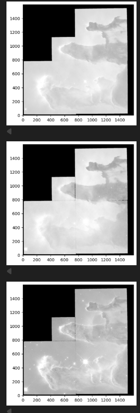
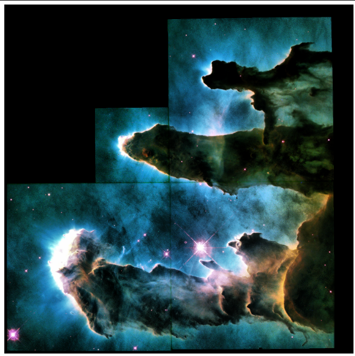

# The Pillars of Creation — Deep Processing Workflow

A deep‑processing astrophotography project built from raw SHO narrowband data of the Pillars of Creation (M16). This repository documents a full scientific imaging pipeline that reconstructs the iconic structure through SHO channel normalization, color balancing, Richardson–Lucy deconvolution, LRGB destacking, and super‑resolution reconstruction — finishing with an exploratory sonification of the final image.




Overview
--------
This project combines astrophysical rigor and image‑science techniques to produce a high‑fidelity, detail‑rich visualization of the Pillars of Creation from raw narrowband FITS exposures. The notebooks in this repository walk the processing from raw FITS → calibrated SHO channels → combined RGB mapping → luminance enhancement → final cosmetic and scientific adjustments. The workflow is reproducible and designed for researchers and advanced hobbyists.

Highlights
----------
- SHO channel normalization and calibration
- Color mapping and balanced compositing to recover ionization structure
- Luminance enhancement using Richardson–Lucy deconvolution
- LRGB destacking and super‑resolution reconstruction to recover dust‑lane geometry and shock fronts
- Final sonification of the image (experimental)

Data snapshot
-------------
An example intermediate array used in the workflow:

initial fits_oiii array:
```
array([[0., 0., 0., ..., 0., 0., 0.],
       [0., 0., 0., ..., 0., 0., 0.],
       [0., 0., 0., ..., 0., 0., 0.],
       ...,
       [0., 0., 0., ..., 0., 0., 0.],
       [0., 0., 0., ..., 0., 0., 0.],
       [0., 0., 0., ..., 0., 0., 0.]], shape=(1600, 1600), dtype='>f4')
```

This array corresponds to a raw OIII channel frame before normalization. A normalization step is applied in the notebook; an example of the normalized frame is shown above (Screenshot 2025-12-05 142716.png). The final processed image is shown in Screenshot 2025-12-05 142459.png.

Repository structure
--------------------
- notebooks/ — Jupyter notebooks that implement the processing steps (primary content)
- data/      — place raw FITS files and calibration frames here (ignored in repo)
- outputs/   — exported images, intermediate FITS outputs, and sonification files
- docs/      — processing notes, parameter logs, and provenance metadata

If a different layout exists, please adapt accordingly — the notebooks are written to locate data under `data/` by default.

Quick start
-----------
1. Clone the repository:

   git clone https://github.com/Deepmalya2506/The-Pillars-Of-Creation.git
   cd The-Pillars-Of-Creation

2. Create and activate a Python virtual environment (recommended):

   python3 -m venv venv
   source venv/bin/activate

3. Install common dependencies used for astrophotography processing (example):

   pip install -r requirements.txt

   If no requirements.txt is present, typical packages used in the notebooks include:
   - numpy, scipy, astropy, photutils
   - scikit-image, scikit-learn
   - matplotlib, seaborn
   - jupyterlab / notebook
   - tifffile, imageio
   - notebook extensions for interactive visualization

4. Start Jupyter Lab or Notebook and open the primary notebooks:

   jupyter lab

Processing workflow (notebooks)
------------------------------
The notebooks are structured to follow a reproducible pipeline. Typical sections include:

1. Ingest & metadata
   - Read raw FITS exposures (Hα, SII, OIII) and calibration frames (bias, dark, flats)
   - Validate headers and unify WCS/tile geometry

2. Calibration & alignment
   - Bias/dark/flat calibration
   - Subframe registration and stacking to produce clean SHO masters

3. SHO normalization & color mapping
   - Per-channel normalization to match dynamic ranges
   - Apply narrowband false‑color mapping (commonly Hα→R, SII→G, OIII→B) with color balance

4. Luminance & deconvolution
   - Create luminance channel (from stacked masters or combined luminance)
   - Apply Richardson–Lucy deconvolution with a measured or synthetic PSF to enhance sharp features

5. Destacking & super‑resolution
   - LRGB destacking approach to combine narrowband color information with enhanced luminance
   - Apply super‑resolution or upscaling techniques to recover fine structures (carefully to avoid artifacts)

6. Final cosmetic work & sonification
   - Local contrast tweaks, masking, and denoising
   - Export final images and produce sonification from scaled image channels (experimental)

Best practices & tips
---------------------
- Keep provenance: store parameter sets, used PSF, and notebook execution timestamps in `docs/` so results are reproducible.
- Work with calibrated masters, not single frames, when performing deconvolution to reduce noise amplification.
- Regularize deconvolution: limit iterations, and use appropriate regularization to avoid ringing.
- When using super‑resolution, validate results against lower‑resolution inputs to detect hallucinated structures.

Outputs & examples
------------------
- Normalization preview: `Screenshot 2025-12-05 142716.png`
- Final processed image: `Screenshot 2025-12-05 142459.png`

Sonification
------------
An experimental notebook demonstrates sonification of image channels — mapping pixel intensity and spatial patterns to sound parameters (frequency, timbre, panning) to create an auditory representation of the Pillars. Results and exported audio files are saved in `outputs/sonification/`.

Caveats
-------
- This project processes real astronomical data. Avoid overinterpreting tiny photometric or morphological features introduced by aggressive processing.
- Some notebooks may assume local data paths. Update the paths at the top of each notebook to match your environment.

Contributing & reproducibility
------------------------------
Contributions are welcome. If you add notebooks or modify workflows:
- Add a short README in the notebook folder describing purpose and inputs
- Commit small, focused changes and include a reproducible example
- Document parameter changes and test on a held‑out subset of data

No license file is included per repository request.

Contact
-------
Maintained by Deepmalya2506. Open issues for processing questions, reproducibility checks, or to share derivative works.